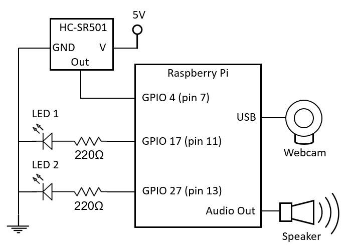

# PumpkinPi

PumpkinPi turns your Raspberry Pi into a electronic jack-o'-lantern! A Node.js application provides a web UI and API for controlling LEDs, speakers, and a motion sensor connected to a Raspberry Pi, all housed in plastic jack-o'-lantern shell. The jack-o-lantern can be controlled manually through the web, or it can automatically respond when it detects motion!

## Getting Started

Here we'll cover the hardware and software needed to get going with this code.

### Hardware

Parts needed:
- Raspberry Pi
- micro SD card
- Motion sensor (HC-SR501 passive IR)
- Two red LEDs
- Current-limiting resistors (approx 220 Ω)
- Small speakers
- Jack-o'-lantern plastic shell
- USB webcam

Assembling the hardware:
- Cut LED-sized holes in the eyes of the jack-o'-lantern.
- Cut a motion sensor-sized hole in the nose of the jack-o'-lantern.
- Cut a hole in the back of the jack-o'-lantern for power cables.
- Place the speakers in the bottom of the jack-o'-lantern, and run the power cable out the back hole.
- Place the Raspberry Pi in the jack-o'-lantern, and and run its power cable out the back hole.
- Connect the speakers to the Raspberry Pi's 3.5mm audio output jack.
- Place the LEDs through the eyeholes, and connect their positive pins to GPIO 17 (pin 11) and GPIO 27 (pin 13) on the Raspberry Pi. Be sure to include a current-limiting resistor in series as well. Connect the other pin of the LEDs to ground.
- Place the motion sensor in the nose hole, connecting it to 5 volts, ground, and GPIO 4 (pin 7).
- Connect the USB webcam to a USB port on the Raspberry Pi.




### Prerequisites

- Install [Raspbian](http://raspbian.org/) on the Raspberry Pi. Use [NOOBS](https://www.raspberrypi.org/documentation/installation/noobs.md) for an easy install process.
- Install [Node.js](https://nodejs.org) on the Raspberry Pi:
    ```sh
    $ curl -sL https://deb.nodesource.com/setup_8.x | sudo -E bash -
    $ sudo apt-get install -y nodejs
    ```
- To support an attached USB webcam, install [fswebcam](https://manpages.debian.org/jessie/fswebcam/fswebcam.1.en.html):
    ```sh 
    $ sudo apt-get install fswebcam
    ```

### Installing

On your Raspberry Pi, clone the PumpkinPi repository:

```sh
$ git clone https://github.com/matthewjustice/pumpkinpi.git
```

Change directories

```sh
$ cd pumpkinpi/node
```

Install the application

```sh
$ npm install
```

Start the application

```sh
$ npm start
```

At this point the application should be running on the Raspberry Pi on port 5000. Connect to it from a web browser on your local network using the IP address of the Raspberry Pi. For example, if your Raspberry Pi's IP is 192.168.1.123, point your web browser to http://192.168.1.123:5000. 

## API Documentation

This project makes its functionality available with a web UI and a web API. If you would prefer to use the API directly rather than use the built-in UI, see the [API documentation](docs/API.md) for details.

## Built With

- [Node.js](https://nodejs.org) - The web server platform
- [Express](http://expressjs.com/) - The application framework
- [onoff](https://www.npmjs.com/package/onoff) - Used for GPIO access from Node.js
- [socket.io](https://socket.io/) - Used for event notifications
- [vash](https://github.com/kirbysayshi/vash) - Razor syntax in views


## Authors

- **Matthew Justice** [matthewjustice](https://github.com/matthewjustice)
- **Ivy Justice** 

See also the list of [contributors](https://github.com/matthewjustice/pumpkinpi/contributors) who participated in this project.

## License

This project is licensed under the MIT License - see the [LICENSE](LICENSE) file for details
